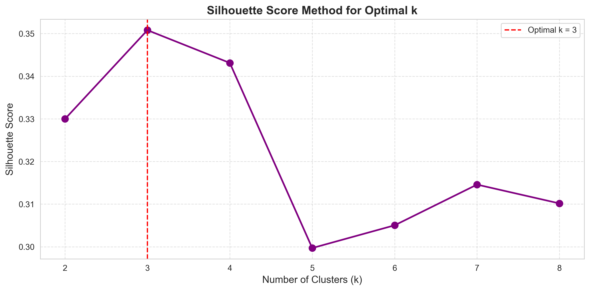

# 🛒 Black Friday EDA & Customer Segmentation

An end-to-end data science project analyzing 100k Black Friday transaction records. This project includes exploratory data analysis (EDA), rigorous statistical validation, customer re-segmentation using **K-Means clustering on RFM metrics**, and an interactive Streamlit dashboard.

---

## 📊 Project Overview

The objective is to discover actionable business insights regarding promotional performance, product categories, and customer behavior during the Black Friday week compared to normal periods. 

### 💡 Key Findings
* **Synthetic Dataset Warning:** The pre-existing customer segment labels (`Loyal`, `VIP`, `New`, `Returning`) were completely randomized/synthetic. They all shared identical average Recency, Frequency, and Monetary (RFM) scores.
* **Electronics Dominance:** Electronics was the largest revenue driver, contributing **$14.12M (40.2%)** out of the total **$35.13M** sales. Home & Kitchen was second at 18.4%.
* **Optimal Discounts:** 20%-30% discounts drove the highest revenue. Extreme discounts (50%-60%) showed a massive drop in both sales volume and revenue.
* **K-Means RFM Segments:** Re-clustering the customers using actual RFM metrics (validated via Silhouette Score) successfully mapped 4 distinct tiers:
  * **Champions/VIPs** (7.4%): High spend ($4.2k avg), high frequency.
  * **Loyal Shoppers** (29.9%): Consistent purchases ($1.3k avg spend).
  * **Occasional Shoppers** (36.3%): Active but lower spend ($600 avg).
  * **At-Risk** (26.4%): Dormant customers with low spend (~$547 avg).

---

## 📸 Analytical Highlights

<p align="center">
  <br>
  <em>Clear spike in transaction volume and revenue strictly bound to the Black Friday promotional week</em>
</p>

<p align="center">
  <br>
  <em>Mathematical validation of cluster separability using Silhouette Score</em>
</p>

<p align="center">
  <br>
  <em>Visualizing the distinct, mathematically-validated RFM customer profiles</em>
</p>

---

## 🗂️ Project Structure

```text
├── plots/                                     # High-resolution visualization charts exported from EDA
├── main.ipynb                                 # Complete Notebook for EDA, K-Means Clustering, and Stat Testing
├── app.py                                     # Streamlit dashboard application with interactive filters
├── Dataset_Black_Friday_Explanation.md        # Detailed dataset schema explanation
├── requirements.txt                           # Python dependencies
├── .gitignore                                 # Git rules
└── README.md                                  # Project documentation
```

---

## 🛠️ Tech Stack

* **Language:** Python 3.9+
* **Data Processing & Stats:** `pandas`, `numpy`, `scipy`
* **Machine Learning:** `scikit-learn` (K-Means Clustering, StandardScaler, Silhouette Score)
* **Data Visualizations:** `matplotlib`, `seaborn`
* **Dashboard Framework:** `streamlit`

---

## 🚀 How to Run the Project

### 1. Prerequisites
Ensure you have Python 3.9+ installed on your system.

### 2. Installation
Install the required dependencies using pip:
```bash
pip install -r requirements.txt
```

### 3. Running the Dashboard
Launch the interactive Streamlit application:
```bash
streamlit run app.py
```
